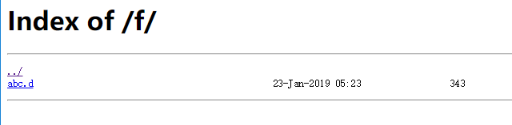

## 08、文件列表

### 1、何为文件列表

如下图：



简单来说，就是用户可以下载一些你想给他下载的文件，我们有时候会遇见这些需求。

这些就是 【文件列表】。

### 2、如何配置文件列表

核心属性是 location 配置里的 autoindex

简单来说，location 配置路径，autoindex 值为 on 的时候，则打开文件列表模式。

然后配置下载路径，以及设置文件所在目录即可。

```
location ^~ 用户访问的路径 {
    alias  本地文件存储目录;
    autoindex  on;
}
```

<b>举个例子：</b>

为了方便理解，举例来说，我希望用户访问 ``http://a.test.com/files/`` 目录时，可以访问到本地的 ``/usr/local/nginx/files/`` 目录里的文件。

```
location ^~ /files/ {
    alias  /usr/local/nginx/files/;
    autoindex  on;
}
```

<b>属性分析：</b>

* ``location`` ：表示路径匹配设置，固定不变。
* ``^~`` ：表示如果该符号后面的字符是最佳匹配，采用该规则，不再进行后续的查找。我们在配置这个功能的时候，通常这么配置就可以了。
* ``/files/`` ：表示用户访问路径 ``/files/`` 的时候，符合这条匹配规则，被这条配置处理；
* ``alias`` ：和 root 类似，但效果有所不同：
    * alias ：指访问 ``http://a.test.com/files/`` 时，实际访问的是 ``/usr/local/nginx/files/`` 目录；
    * root ：这里指后面不变，访问 ``http://a.test.com/files/`` 时，实际访问的是 ``/usr/local/nginx/files/files/`` 目录；
    * 即使用 root 时，本地目录会将 location 路径 ``/files/`` 加到本地目录后面；
    * 而 alias 时，本地目录会无视 location 路径；
* ``/usr/local/nginx/files/`` ：本地目录；
* ``autoindex`` ：默认为 off 不打开，未打开的时候，将不能以文件目录的形式访问页面；

<b>直接在某个目录打开文件功能：</b>

```
location /files/ {
    root   html;
    autoindex  on;
}
```

* 访问 /files/ 目录时，以文件列表的形式来访问目录；


### 3、指令配置

<b>autoindex_exact_size [on|off]</b>

* 默认值为 on，显示详细的大小，比如 2188060 ；
* off 时，文件大小则以 B（省略）、K、M等单位来显示（分别表示B、KB、MB等）；

<b>autoindex_localtime [on|off]</b>

* 开启以本地时间来显示文件时间的功能，默认为关；
* 即默认显示的是 服务器时间的 文件时间；
* on 时，显示文件时间为 本地时间；


### 4、参考博客

* https://stackoverflow.com/questions/10631933/nginx-static-file-serving-confusion-with-root-alias （讲了 alias 和 root 的区别）
* 